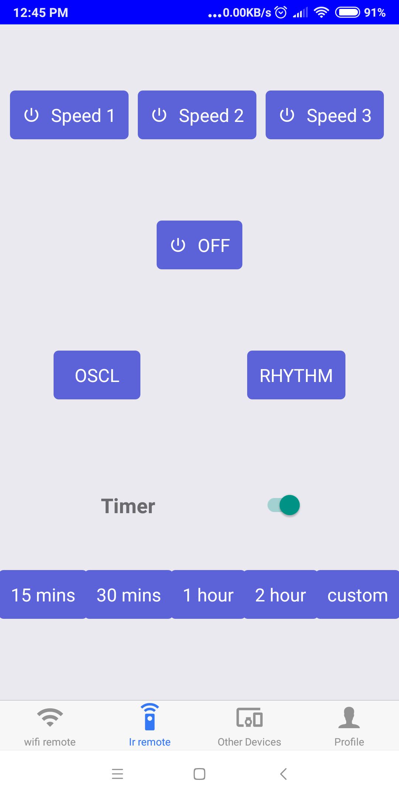

# SmartHome

## Introduction 
The smart home concept is a quite popular thing in these days. There are several pre built systems to buy in the market but I wanted to implement my own system. So I decided to start with a burnt wall fan which is laying in my room for several months.
This system contains two parts
  * Custom created PCB placed in fan
  * The android application

## Technologies
1. Printed circuit Board(PCB)
    * Eagle cad(to design the PCB)
    * C++ (To programe the microcontroller)
    
2. Android Application
    * React Native 
    
This repository is about Android application.

## Features
Using Android application, fan can be operated either with Wi-Fi or IR blaster transmitter(if available).

Features are
* Turn fan ON/OFF
* Set timers
* Swing mode
* Natural mode
* Get Temperature/Humidity details inside room

## Screen Shots

  
  
 
  
 
  
 

## Demo

Demo Video is[ Here](https://drive.google.com/open?id=1-OE119SbUDRViZNdhZerIEEUaRyvhNer)

## To-DO List

* Redesign interfaces
* Integrate home lights and other electronics devices.
* Add firebase database to log data and controll devices over the internet
* Integrate Redux.

